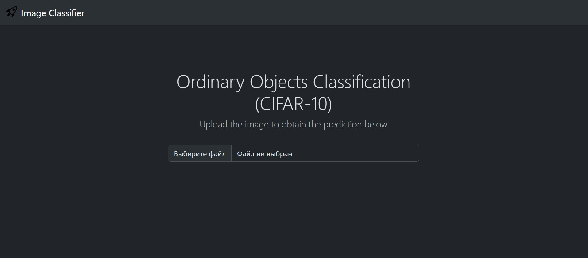

# CIFAR-10 Image Classifier [Web-App]

This repository is intended for storing code needed to launch a web application capable of predicting CIFAR-10 image classes using a custom-trained ResNet model. Built with ***ONNX.js***, ***Tensorflow.js***, ***Webpack*** and ***Bootstrap***, the project demonstrates how to deploy machine learning models in the browser for real-time inference.

## Project workflow

During the execution of the project, I opted for the following workflow:

1. [Creating and training a neural network](./nn_dev/) in PyTorch from scratch on *CIFAR-10* dataset.
2. [Saving the pretrained weights](./nn_dev/huggingface/cnn_model/) of the best-performing model on HuggingFace.
3. [Pulling the weights from HuggingFace](./convert_to_onnx.py) locally to be then used for converting a pretrained PyTorch model into ONNX format.
4. Running the web application via ***Webpack***/***Docker***.

## Running the application

Before launching the web application, one needs to firstly have the *ONNX* model stored locally that will then be used for making image predictions. This can be done by running in the command line:

```bash
# Installing necessary requirements to venv
pip install -r requirements-onnx.txt
# Saving ONNX model locally
python convert_to_onnx.py
```
> After installing necessary libraries, the script will load the pretrained weights to the model and then export it to ONNX format.

### Webpack

We can launch the project via ***Webpack***. Firstly, one needs to have *Node.js* installed locally and then run the following command to install dependencies:

```bash
# Installing modules for Node.js
npm ci
```

Then, if one needs to test the web-app in development mode, then we can run:

```bash
# Dev-mode
npm start
```

Or in production mode:

```bash
# Production mode
npm run build
# Running server on compiled files
http-server ./dist
```

### Docker

An easier approach though is to run the application in a Docker container without the need to install *Node.js*. For that one needs to just run two commands:

```bash
# Building Docker image
docker build -t cifar10_app .
# Running the website in a Docker container
docker run --name cifar10_app_cont -p 8080:8080 cifar10_app
```

## Web-application interface

After the application has been launched online, one can access the website on port 8080:



In order to trigger the model, we need to upload the image. The application will automatically run the prediction of the image as soon as it is loaded, for example:


We can see that the image uploaded is shown on the website and the predicted class is retrieved onto a separate section. For instance, if we test some other image after ship image:


